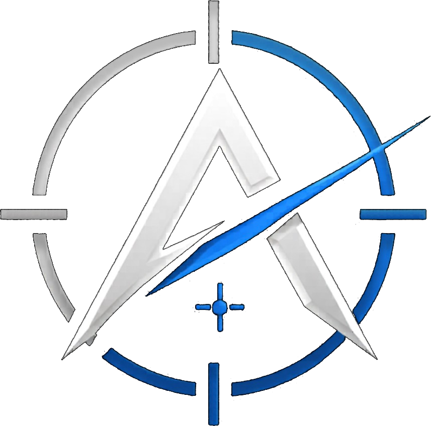
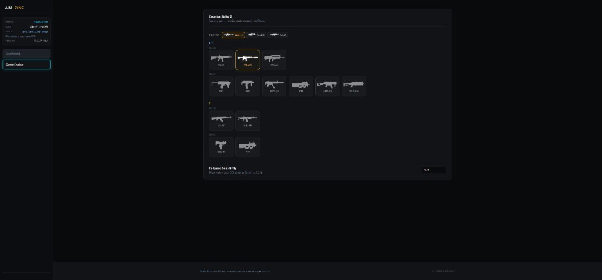

<p align="center">
  
</p>

<h1 align="center">AimSync CS2 Makcu</h1>

<p align="center">
  CS2 recoil control for <a href="https://www.makcu.com/">Makcu</a> — web dashboard, dual-PC or Raspberry Pi.
</p>

<p align="center">
  
  
  
</p>

---

## What is AimSync CS2 Makcu?

**AimSync CS2 Makcu** runs on a **second machine** (Windows PC or Raspberry Pi) and drives your gaming mouse through **Makcu** USB HID while you play **Counter-Strike 2** on your main PC.

- **Hardware input** — movement goes through Makcu, not software mouse simulation on the game PC  
- **Web dashboard** — configure from the browser at `http://<host>:5000` (phone, tablet, or second monitor)  
- **CS2 profiles** — CT/T weapon picker with sensitivity scaling  
- **Same UI everywhere** — Windows installer or Pi Docker stack

## How it fits together

```text
[Gaming PC]     CS2 + your mouse wired through Makcu
      │
      ▼
[2nd PC or Pi]  AimSync CS2 Makcu + Makcu USB
      │
      ▼
[Browser]       Dashboard · Game Engine · settings
```

## Requirements

| | |
|---|---|
| **Game PC** | Windows, CS2 |
| **Hub host** | Windows 10/11 **or** Raspberry Pi 4/5 (64-bit) with Docker |
| **Hardware** | [Makcu](https://www.makcu.com/) on the hub host |
| **Network** | Same LAN for remote dashboard access (optional) |

## Quick start — Windows

```bat
git clone https://github.com/Kava4/AimSync-CS2-Makcu.git
cd AimSync-CS2-Makcu
scripts\install.bat
scripts\run.bat
```

Open **http://localhost:5000**

Config is saved to `%APPDATA%\AimSyncCS2Makcu\config.json`.

### First-time setup

1. **Dashboard** — enable recoil, set your CS2 sensitivity, bind a toggle hotkey (e.g. M5).  
2. **Game Engine** — pick your weapon (AK, M4, SMGs, etc.).  
3. In CS2, match the same sensitivity as in the dashboard.

## Quick start — Raspberry Pi

Plug Makcu into the Pi, then:

```bash
git clone https://github.com/Kava4/AimSync-CS2-Makcu.git
cd AimSync-CS2-Makcu
docker compose up -d --build
```

Open **http://\<pi-ip\>:5000**

If Makcu is not detected, set the device path in `docker-compose.yml` (see comments in the file).

Deploy or update from a Windows machine:

```bash
python scripts/pi/deploy.py --host <pi-ip>
```

## Dashboard overview

| Section | What it does |
|---------|----------------|
| **Dashboard** | Master on/off, sensitivity, RMB gate, hotkeys |
| **Game Engine** | CS2 weapon selection (CT / T) |

<p align="center">
  
</p>

The sidebar shows Makcu status, LAN address for mobile access, and app version.

## Disclaimer

For educational and hardware testing purposes. Using automation in online games may violate terms of service. Use at your own risk.

## License

See [LICENSE](LICENSE).
